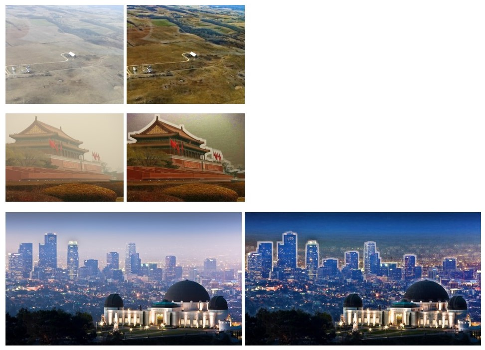

# Haze Removal Using Dark Channel Prior

This project is an unofficial implementation of the paper [*Single Image Haze Removal Using Dark Channel Prior*](http://kaiminghe.com/publications/cvpr09.pdf), which includes:
1. The observation and description of dark channel prior
2. Estimation of medium transmission (i.e. the portion of light not scattered and reaching the camara) with slide windows
3. Estimation of the atmospheric light
4. Soft matting to refine the estimation of medium transmission (1. uses local minimum to estimate local transmission, so the boundary between objects of different depth would be unnatural)*
5. Scene radiance recovering

*: 4. is not applied in this project because the process of calculating transmission by solving a sparse linear system requires too large memory space). As a result, the boundary problem remains in the following examples.

## Experiment results

